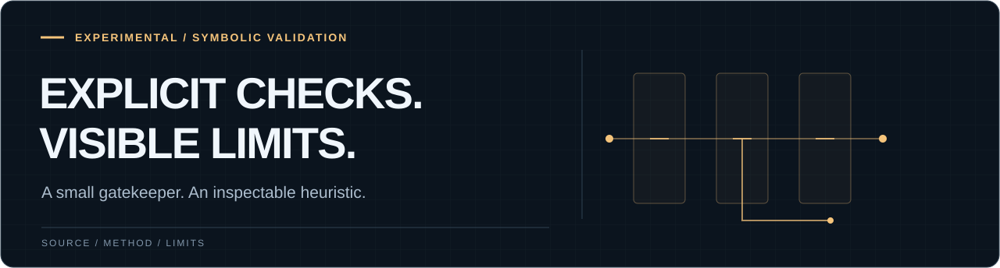

<p>
  
</p>

# Symbolic Validation Framework (SVN 1.2)

A small Python gatekeeper for text outputs, with symbol time-to-live,
a word-diversity heuristic, and caller-supplied reality and utility checks.

**Experimental prototype. The current test suite has a known failure.**
This implementation does not establish truth, emotional safety, or prevention
of recursive drift.

[Try the example](#try-the-example) · [What it checks](#what-it-checks) · [Known limitations](#known-limitations)

---

## Try the example

Python 3.7 or newer; standard library only.

```bash
git clone https://github.com/regsaddler/symbolic-validation-framework.git
cd symbolic-validation-framework
python3
```

Paste this into the Python interpreter:

```python
from symbolic_gatekeeper import SymbolicGatekeeper

# Illustrative callbacks, not factual verification.
def reality_check(output):
    return "falsehood" not in output.lower()

def utility_check(output):
    return len(output.split()) > 5

gatekeeper = SymbolicGatekeeper(reality_check, utility_check)
symbolic_text = "A myth in balance is a map, not a command."
result = gatekeeper.validate_symbolic_output("wisdom_quote", symbolic_text)
print(result)
```

Expected output:

```text
[REJECTED] High entropy in 'wisdom_quote' → Possible recursive drift.
False
```

The original poetic example is rejected: its word-diversity ratio is `0.9`.
That illustrates the heuristic's limitation; the printed drift warning is not
evidence of recursive drift. Even acceptance would only mean the text passed
these checks. The callbacks above cannot determine whether an idea is true or useful.

## What it checks

| Step | Current behavior |
| --- | --- |
| Existing symbol | Removes an expired entry when the same label is validated again |
| Word diversity | Rejects text whose unique-word ratio exceeds `0.85` |
| Reality callback | Applies the function supplied by the caller |
| Utility callback | Applies the function supplied by the caller |
| Accepted result | Stores the text under its label with a default lifetime of 600 seconds |

The function named `semantic_entropy` computes unique whitespace-separated
words divided by total words. It does not compare meanings or calculate
Shannon entropy. For answer clustering, see the separate
[semantic-entropy project](https://github.com/regsaddler/semantic-entropy).

---

## Known limitations

- High word diversity can reject ordinary valid sentences. Repetition can
  lower the score without making text more reliable.
- Expiration is checked lazily for a matching label, not by a background cleanup
  process. The symbol store is in memory.
- The example callbacks are placeholders for checks you must design and validate.
  No factual verifier, emotional-safety evaluator, or recursion monitor is included.

Run the existing tests from the repository root:

```bash
python3 -B -m unittest discover -s tests -v
```

As checked on October 2, 2026, `test_validation` fails: its expected-valid sentence
exceeds the word-diversity threshold. The other test passes through a utility
rejection, so it does not isolate the entropy check its name describes. This
README repair documents those limitations without changing the algorithm or
rewriting the tests to make them pass.

<details>
<summary>Possible extensions — not implemented</summary>

## Possible extensions

The original proposal included emotion-symbol decoupling, a recursion-loop
monitor, and YAML-configurable validation chains. These remain ideas, not
implemented capabilities.

</details>

## License

[MIT License](LICENSE.txt) © 2025

---

<sub>PUBLIC RESEARCH TOOLS</sub>

[Reg Saddler](https://github.com/regsaddler) · [receipt-run-lite](https://github.com/regsaddler/receipt-run-lite) · [semantic-entropy](https://github.com/regsaddler/semantic-entropy) · [Difference Theory](https://differencetheory.com)
